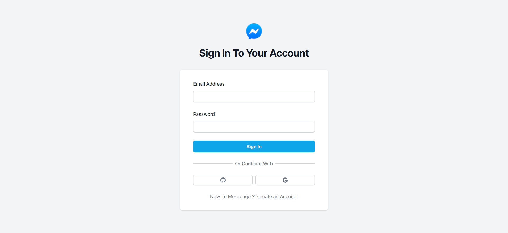
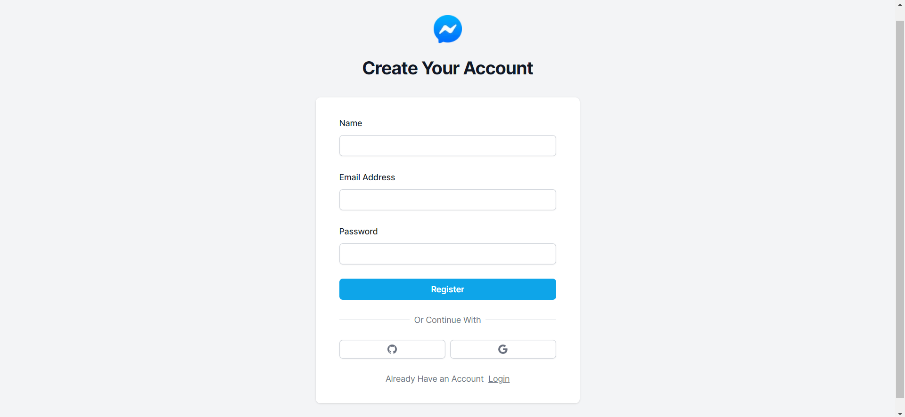
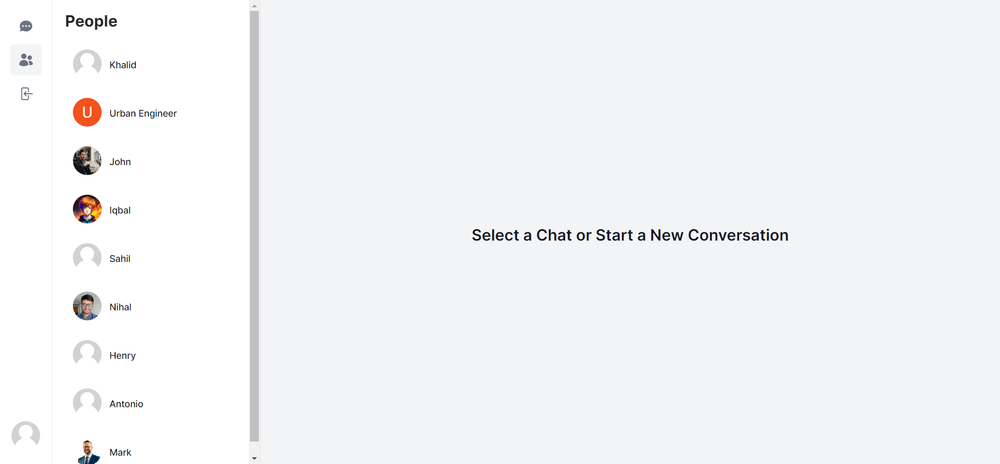
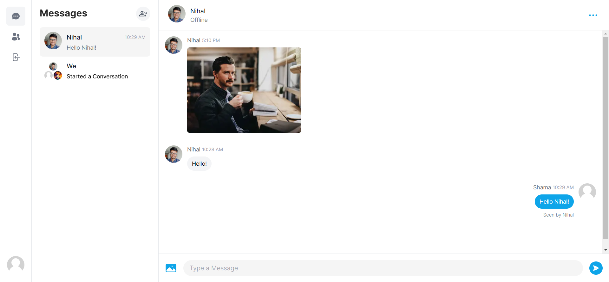
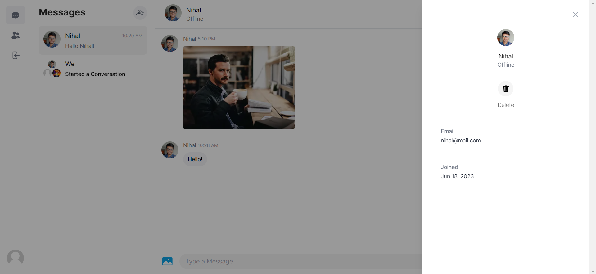
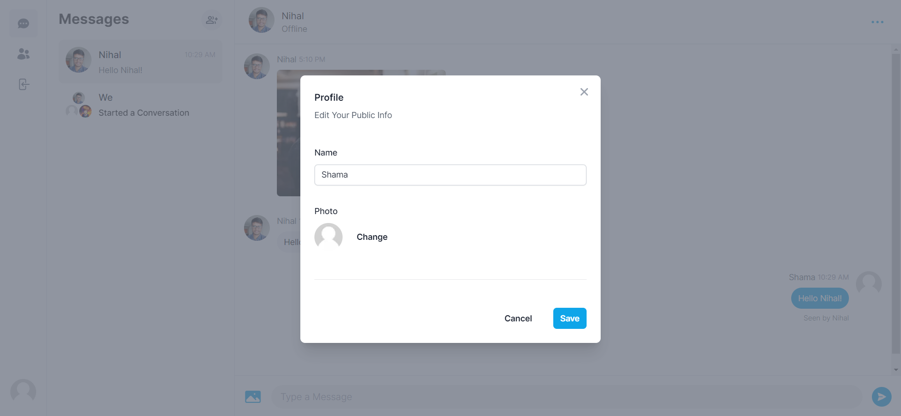

# Messenger Clone

A real-time messaging application built using Next.js, MongoDB, Prisma, Tailwind CSS, and Pusher.

## App Screenshots

<p align="center">


</p>
<p align="center">


</p>
<p align="center">


</p>

## Table of Contents

- [Features](#features)
- [Installation](#installation)
- [Usage](#installation)
- [Technologies](#technologies)

## Features

- User registration and authentication using NextAuth with Google and GitHub authentication providers.
- Real-time messaging with Pusher for instant message updates.
- Fully responsive design for seamless usage across all devices.
- File and image upload functionality using Cloudinary CDN for efficient media storage and delivery.
- Offline/online user status indicators for better communication awareness.
- Group chats and one-on-one messaging capabilities for versatile conversations.
- Sleek user interface design powered by Tailwind CSS for an aesthetically pleasing experience.
- Tailwind CSS animations and transition effects to enhance user interactions.
- Edit user data, including profile picture, to personalize the user experience.

## Installation

To get started with the Messenger Clone project, follow these steps:

1. Clone the Repository:

   ```
   git clone https://github.com/nihalmohammed18/messenger-app.git
   ```

2. Navigate to the project directory:

   ```
   cd messenger-app
   ```

3. Install the Dependencies:

   ```
   npm install
   ```

4. Set up the environment variables:

   - Create a .env file based on the provided example.env file.
   - Replace the placeholder values with your own credentials and configurations.

5. Set up the database:

   - Create a Database on MongoDB Atlas.
   - Add the Connection String as `DATABASE_URL` in the .env file. Make sure to include the username and password.

6. Setup Prisma:

   ```
   npx prisma db push
   ```

7. Setup Cloudinary for image uploads.

   - Create a Cloudinary account.
   - Create an unsigned upload preset.
   - Add the upload preset name as `NEXT_PUBLIC_CLOUDINARY_UPLOAD_PRESET` in the .env file.
   - Add the public cloud name as `NEXT_PUBLIC_CLOUDINARY_CLOUD_NAME` in the .env file.

8. Obtain the ID and Secret for GitHub and Google authentication:
   - Configure GitHub authentication by creating a GitHub OAuth application and obtaining the Client ID and Client Secret.
   - Configure Google authentication by creating a Google OAuth application and obtaining the Client ID and Client Secret.
   - Add the corresponding IDs and Secrets to the .env file.

## Usage

Once you have completed the installation steps, you can start the development server:

```
npm run dev
```

The application will be accessible at `http://localhost:3000`.

## Technologies

The Messenger Clone project is built using the following technologies:

- <a href="https://nextjs.org" target="_blank">Next.js</a> - A React framework for server-side rendering and static site generation.
- <a href="https://mongodb.com" target="_blank">MongoDB</a> - A popular NoSQL database for storing application data.
- <a href="https://prisma.io" target="_blank">Prisma</a> - A database toolkit that provides an ORM for TypeScript and JavaScript.
- <a href="https://tailwindcss.com" target="_blank">Tailwind CSS</a> - A utility-first CSS framework for building custom user interfaces.
- <a href="https://pusher.com" target="_blank">Pusher</a> - A platform for building real-time applications with WebSocket functionality.
- <a href="https://cloudinary.com" target="_blank">Cloudinary</a> - A cloud-based media management platform for optimizing and delivering images and videos.
- <a href="https://next-auth.js.org" target="_blank">NextAuth</a> - A complete authentication solution for Next.js applications.

Happy messaging! If you have any questions or need further assistance, please don't hesitate to reach out.
